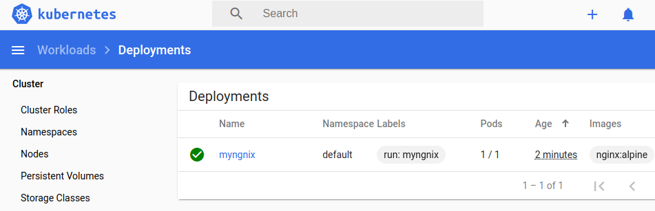
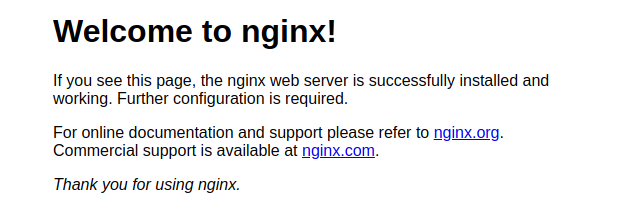
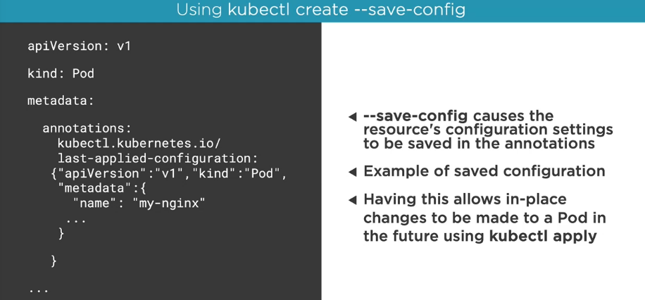
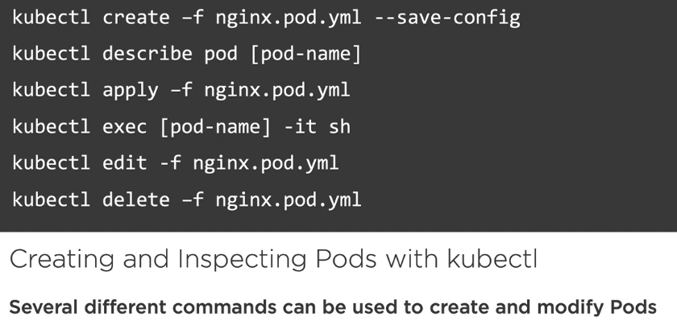
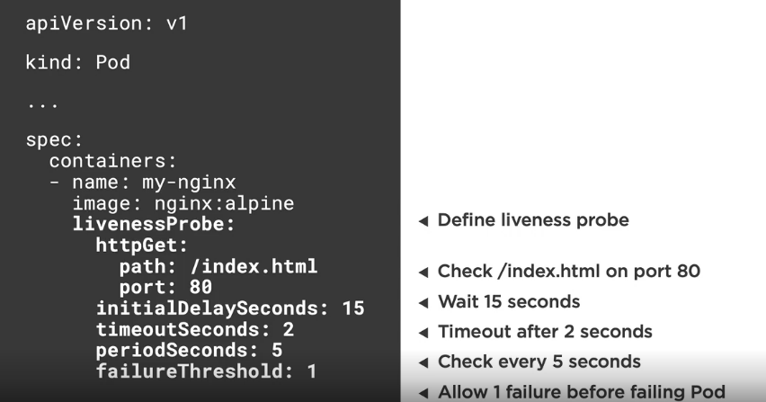
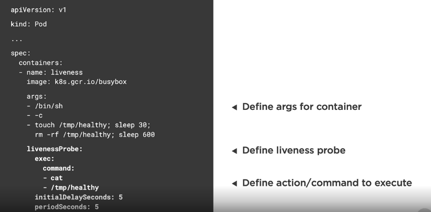
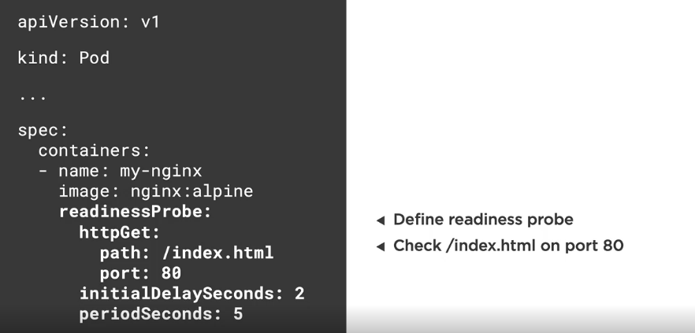

# Creating pods

## 1. Using kubectl

We can create a pod using kubectl.

kubectl run [podname] --image=[image name]

For example, run the nginx:alpine container in a Pod

```shell
$ kubectl run myngnix --image=nginx:alpine

kubectl run --generator=deployment/apps.v1 is DEPRECATED and will be removed in a future version. Use kubectl run --generator=run-pod/v1 or kubectl create instead.
deployment.apps/myngnix created
```

We must use the new alternative suggested in the message




## 2. kubectl get command

The kubectl get command can be used to retrieve information about Pods and many other Kubernetes objects.

List only Pods

```shell
$ kubectl get pods

NAME                       READY   STATUS    RESTARTS   AGE
myngnix-7d48fd4f6b-7s6hz   1/1     Running   0          6m57s

```

List all resources

```shell
$ kubectl get all


NAME                           READY   STATUS    RESTARTS   AGE
pod/myngnix-7d48fd4f6b-7s6hz   1/1     Running   0          7m33s

NAME                 TYPE        CLUSTER-IP   EXTERNAL-IP   PORT(S)   AGE
service/kubernetes   ClusterIP   10.96.0.1    <none>        443/TCP   72m

NAME                      READY   UP-TO-DATE   AVAILABLE   AGE
deployment.apps/myngnix   1/1     1            1           7m33s

NAME                                 DESIRED   CURRENT   READY   AGE
replicaset.apps/myngnix-7d48fd4f6b   1         1         1       7m33s

```

## 3. Expose a Pod Port

Pods and containers are only accesible within the Kubernetes cluster by default

One way to expose a container port externally: kubectl port-forward

kubectl port-forward [name-of-pod] 8080:80

```shell
$ kubectl port-forward myngnix-7d48fd4f6b-7s6hz 8080:80
```

Accesing using the browser at http://localhost:8080 we can see the welcome page of nginx.



8080 is the external port, and 80 the internal port. Is similar as docker.

## 4. Deleting a Pod

Running a Pod will cause a deployment to be created.

To delete a Pod use kubectl delete pod or find the deployment and use kubectl delete deployment.

```shell
$ kubectl delete pod myngnix-7d48fd4f6b-7s6hz
```

An then, the pod sudden will back to live!

We need to delete the deployment that manages the Pod

kubectl delete [name-of-deployment]

```shell
$ kubectl delete deployment.apps/myngnix
deployment.apps "myngnix" deleted
```

## 5. Defining a Pod with YAML

This is a yaml file that defines a nginx pod

```yaml
apiVersion: v1
kind: Pod
metadata:
  name: my-nginx
spec:
  containers:
  - name: my-nginx
    image: nginx:alpine  
```

- apiVersion: Kubernetes API version
- kind: Type of Kubernetes resource
- metadata: Metadata about the Pod
- spec: The spec/blueprint for the Pod
- containers: Information about the containers that will run in the Pod

__Creating a Pod using yaml__

To create a pod using YAML use the kubectl create command along with the --filename or -f switch.

Perform a "trial" create and also validate the YAML

kubectl create -f [file.pod.yml] --dry-run --validate=true

```shell
$ kubectl create -f nginx.pod.yml --dry-run --validate=true

pod/my-nginx created (dry run)
```

The pod will not be created, only validated the yaml.

Create a Pod from YAML. Will error if Pod already exists

kubectl create -f file.pod.yml

```shell
$ kubectl create -f nginx.pod.yml

pod/my-nginx created
```

__Creating or Applying Changes to a Pod__

To create or apply changes to a pod using YAML use the kubectl apply command along with the --filename or -f switch

Alternate way to create or apply changes to a Pod from YAML

kubectl apply -f file.pod.yml

```shell
$ kubectl apply -f nginx.pod.yml

Warning: kubectl apply should be used on resource created by either kubectl create --save-config or kubectl apply
pod/my-nginx configured
```

Use --save-config when you want to use kubectl appply in the future

kubectl create -f file.pod.yml -save-config

```shell
$ kubectl create -f nginx.pod.yml --save-config
```

--save-config will store current properties in resource's annotations

Example of resource's annotations:



In place/non-disruptive changes can also be made to a Pod using kubectl edit or kubectl patch.

__Deleting a Pod__

To delete a Pod use kubectl delete

kubectl delete pod [name-of-pod]

```shell
$ kubectl delete pod my-nginx

pod "my-nginx" deleted
```

Delete Pod using YAML file that created it

kubectl delete -f file.pod.yml

```shell
$ kubectl delete -f nginx.pod.yml
```

## 6. Kubectl and YAML

We will use the nginx.pod2.yml that contains more info:

```yaml
apiVersion: v1
kind: Pod
metadata:
  name: my-nginx
  labels:
    app: nginx
    rel: stable
spec:
  containers:
  - name: my-nginx
    image: nginx:alpine 
    ports:
    - containerPort: 80
    resources:   
```

Start the pod:

```shell
$ kubectl create -f nginx.pod2.yml --save-config
``` 

Get the pods:

```shell
$ kubectl get pod

NAME       READY   STATUS    RESTARTS   AGE
my-nginx   1/1     Running   0          24s
```

Get only this pod:

```shell
$ kubectl get pod my-nginx

NAME       READY   STATUS    RESTARTS   AGE
my-nginx   1/1     Running   0          24s
```

Get the complete pod info in yaml format:

```shell
$ kubectl get pod my-nginx -o yaml

apiVersion: v1
kind: Pod
metadata:
  annotations:
    kubectl.kubernetes.io/last-applied-configuration: |
      {"apiVersion":"v1","kind":"Pod","metadata":{"annotations":{},"labels":{"app":"nginx","rel":"stable"},"name":"my-nginx","namespace":"default"},"spec":{"containers":[{"image":"nginx:alpine","name":"my-nginx","ports":[{"containerPort":80}]}]}}
  creationTimestamp: "2020-03-18T09:21:06Z"
  labels:
    app: nginx
    rel: stable
  name: my-nginx
  namespace: default
  resourceVersion: "18817"
  selfLink: /api/v1/namespaces/default/pods/my-nginx
  uid: 5993754f-338b-4a29-bb22-1ba82a5f1b32
spec:
  containers:
  - image: nginx:alpine
    imagePullPolicy: IfNotPresent
...
```

Describe the pod:

```shell
$ kubectl describe pod my-nginx

Name:         my-nginx
Namespace:    default
Priority:     0
Node:         m01/172.17.0.2
Start Time:   Wed, 18 Mar 2020 10:21:06 +0100
Labels:       app=nginx
              rel=stable
Annotations:  kubectl.kubernetes.io/last-applied-configuration:
                {"apiVersion":"v1","kind":"Pod","metadata":{"annotations":{},"labels":{"app":"nginx","rel":"stable"},"name":"my-nginx","namespace":"defaul...
Status:       Running
IP:           172.18.0.6
IPs:
  IP:  172.18.0.6
Containers:
...
...
...
Events:
  Type    Reason     Age        From               Message
  ----    ------     ----       ----               -------
  Normal  Scheduled  <unknown>  default-scheduler  Successfully assigned default/my-nginx to m01
  Normal  Pulled     7m25s      kubelet, m01       Container image "nginx:alpine" already present on machine
  Normal  Created    7m25s      kubelet, m01       Created container my-nginx
  Normal  Started    7m25s      kubelet, m01       Started container my-nginx

```

At the end of the info, we can see the information about the events related to the Pod.

Apply the yaml

```shell
kubectl apply -f nginx.pod2.yml

pod/my-nginx configured
```

Enter in the command shell of a pod:

```shell
$ kubectl exec my-nginx -it sh

Edit a the yaml (the yaml mounted in kubernets running the pod). This will open a text editor like vim.

```shell
$ kubectl edit -f nginx.pod2.yml

```

Deleting the pod:

```shell
$ kubectl delete -f nginx.pod2.yml

pod "my-nginx" deleted
```

Summary



## 7. Pod Health

Kubernetes relies on Probes to determine the health of a Pod container

A Probe is a diagnostic performed periodically by the kubelet on a container

The are two types of probes:
- Liveness Probe
- Readiness Probe

Liveness probes can be used to determine if a Pod is healthy and running as expected

Readiness probes can be used to determine if a Pod should receive requests

Failed Pod containers are recreated by default (restartPolicy defaults to Always)


Defining an HTTP Liveness Probe



Defining an ExecAction Liveness Probe



Defining a Readiness Probe



Readiness Probe: When should a container start receiving traffic?

Liveness Probe: When should a container restart?

__Example__

nginx.pod3.yml

```yaml
apiVersion: v1
kind: Pod
metadata:
  name: my-nginx
  labels:
    app: nginx
    rel: stable
spec:
  containers:
  - name: my-nginx
    image: nginx:alpine 
    ports:
    - containerPort: 80
    livenessProbe:
      httpGet:
        path: /index.html
        port: 80
      initialDelaySeconds: 15
      timeoutSeconds: 2 # Default is 1
      periodSeconds: 5 # Default is 10
      failureThreshold: 1 # Default is 3
    readinessProbe:
      httpGet:
        path: /index.html
        port: 80
      initialDelaySeconds: 3
      periodSeconds: 5 # Default is 10
      failureThreshold: 1 # Default is 3
    resources:
```

Start the pod:

```shell
$ kubectl apply -f nginx.pod3.yml

pod/my-nginx created
```

Describe the pod

```shell
$ kubectl describe pod my-nginx

...
   Liveness:       http-get http://:80/index.html delay=15s timeout=2s period=5s #success=1 #failure=1
    Readiness:      http-get http://:80/index.html delay=3s timeout=1s period=5s #success=1 #failure=1
...
```

If we enter in the pod, and delete the index.html...

```shell
$ kubectl exec my-nginx -ti sh

/ # 
/ # cd /usr/share/nginx/html
/usr/share/nginx/html # ls
50x.html    index.html
/usr/share/nginx/html # rm -rf index.html
/usr/share/nginx/html # ls
50x.html
/usr/share/nginx/html # command terminated with exit code 137
```

The pod will terminated and a new pod will be started automatically.

Use the describe command now to view the events:

```shell
$ kubectl describe pod my-nginx

Events:
  Type     Reason     Age                   From               Message
  ----     ------     ----                  ----               -------
  Normal   Scheduled  <unknown>             default-scheduler  Successfully assigned default/my-nginx to m01
  Normal   Pulled     111s (x2 over 7m39s)  kubelet, m01       Container image "nginx:alpine" already present on machine
  Normal   Created    111s (x2 over 7m39s)  kubelet, m01       Created container my-nginx
  Warning  Unhealthy  111s                  kubelet, m01       Readiness probe failed: HTTP probe failed with statuscode: 404
  Warning  Unhealthy  111s                  kubelet, m01       Liveness probe failed: HTTP probe failed with statuscode: 404
  Normal   Killing    111s                  kubelet, m01       Container my-nginx failed liveness probe, will be restarted
  Normal   Started    110s (x2 over 7m39s)  kubelet, m01       Started container my-nginx

...

And if we enter again in the pod, the new pod started will contain the index.thml.
```

## 8. Summary

- Pods are the smallest unit of Kubernetes
- Containers run within Pods and sahre a Pod's memory, IP, volumes, and more
- Pods can be started using different kubectl commands
- YAML can be used to create a Pod
- Health checks provide a way to notify kubernetes when a Pod has a problem


