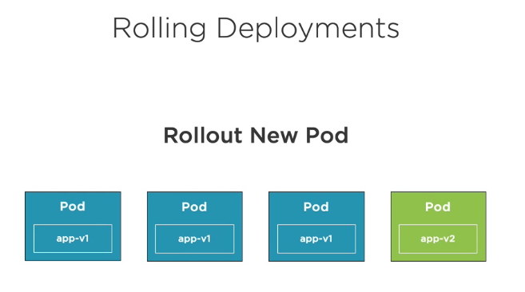

# Creating deployments

## 1. Introduction to Deployments and ReplicaSets

We will see the deployments and replica sets


A __ReplicaSet__ is a declarative way to manage Pods.

A __Deployment__ is a declarative way to manage Pods using a ReplicaSet.


The Role of ReplicaSets


The Role of Deployments


## 2. Creating a Deployment

Defining a Deployment with YAML


Viewing a more detailed Deployment


## 3. Kubectl and Deployments

__Create a Deployment__

Example: nginx.deployment.yml

```yaml
apiVersion: apps/v1
kind: Deployment
metadata:
  name: frontend
  labels:
    app: my-nginx
    tier: frontend
spec: 
  selector:
    matchLabels:
      tier: frontend
  template:
    metadata:
      labels:
        tier: frontend
    spec:
      containers:
      - name: my-nginx
        image: nginx:alpine
        livenessProbe:
          httpGet:
            path: /index.html
            port: 80
          initialDelaySeconds: 15
          timeoutSeconds: 2 # Default is 1
          periodSeconds: 5 # Default is 10
          failureThreshold: 1 # Default is 3
```

kubectl create -f file.deployment.yml

```shell
$ kubectl create -f nginx.deployment.yml

deployment.apps/frontend created
```

```shell
$ kubectl get all

NAME                            READY   STATUS    RESTARTS   AGE
pod/frontend-68887b5fb6-nfcvj   1/1     Running   0          25s
pod/my-nginx                    1/1     Running   1          81m

NAME                 TYPE        CLUSTER-IP   EXTERNAL-IP   PORT(S)   AGE
service/kubernetes   ClusterIP   10.96.0.1    <none>        443/TCP   18h

NAME                       READY   UP-TO-DATE   AVAILABLE   AGE
deployment.apps/frontend   1/1     1            1           25s

NAME                                  DESIRED   CURRENT   READY   AGE
replicaset.apps/frontend-68887b5fb6   1         1         1       25s
```

__Creating or Applying Changes__

Use the kubectl apply command along with the --filename or -f switch

kubectl apply -f file.deployment.yml

```shell
$ kubectl apply -f nginx.deployment.yml

Warning: kubectl apply should be used on resource created by either kubectl create --save-config or kubectl apply
deployment.apps/frontend configured
```

Use --save-config when you want to use kubectl apply in the future

```shell
$ kubectl create -f nginx.deployment.yml --save-config
```

__Getting Deployments__

Get all Deployments

```shell
$ kubectl get deployments

NAME       READY   UP-TO-DATE   AVAILABLE   AGE
frontend   1/1     1            1           6m
```

List all Deployments and their labels

```shell
$ kubectl get deployments --show-labels

NAME       READY   UP-TO-DATE   AVAILABLE   AGE     LABELS
frontend   1/1     1            1           7m13s   app=my-nginx,tier=frontend

```

To get information about a Deployment with a specific label, use the - switch

```shell
$ kubectl get deployment -l app=my-nginx

NAME       READY   UP-TO-DATE   AVAILABLE   AGE
frontend   1/1     1            1           9m37s
```

__Deleting a Deployment__

To delete a Deployment use kubectl delete

Will delete the Deployment and all associated Pods/Containers

kubectl delete deployment [deployment-name]

```shell
$ kubectl delete deployment frontend

deployment.apps "frontend" deleted
```

Alternatively we can use the -f flag and give the name of the yaml file of the deployment.

## 4. Scaling Pods Horizontally

Update the YAML file or use the kubectl scale command

kubectl scale deployment [deployment-name] --replicas=5

```shell
$ kubectl scale deployment frontend --replicas=5

deployment.apps/frontend scaled
```

Viewing the changes:

```shell
$ kubectl get all

NAME                            READY   STATUS    RESTARTS   AGE
pod/frontend-68887b5fb6-6qk7g   1/1     Running   0          49s
pod/frontend-68887b5fb6-dl6kt   1/1     Running   0          47s
pod/frontend-68887b5fb6-h4hd2   1/1     Running   0          47s
pod/frontend-68887b5fb6-kns42   1/1     Running   0          47s
pod/frontend-68887b5fb6-mbqkf   1/1     Running   0          47s

NAME                 TYPE        CLUSTER-IP   EXTERNAL-IP   PORT(S)   AGE
service/kubernetes   ClusterIP   10.96.0.1    <none>        443/TCP   19h

NAME                       READY   UP-TO-DATE   AVAILABLE   AGE
deployment.apps/frontend   5/5     5            5           49s

NAME                                  DESIRED   CURRENT   READY   AGE
replicaset.apps/frontend-68887b5fb6   5         5         5       49s
```

Using the yaml file:

```shell
$ kubectl scale -f nginx.deployment.yml --replicas=5
```

Adding this to the yaml file:

```yaml
spec:
  replicas: 3
  selector:
    tier: frontend
```

## 5. Adding limits

We can add limits (memory & cpu) to our pods

```yml
...
    spec:
      containers:
      - name: my-nginx
        image: nginx:alpine
        ports:
        - containerPort: 80
        resources:
          limits:
            memory: "128Mi" #128 MB
            cpu: "200m" #200 millicpu (.2 cpu or 20% of the cpu)
        livenessProbe:
          httpGet:
            path: /index.html
            port: 80
          initialDelaySeconds: 15
          timeoutSeconds: 2 # Default is 1
          periodSeconds: 5 # Default is 10
          failureThreshold: 1 # Default is 3
```


## 6. Deployment Options

How do you update existing pods?


Zero downtime deployments allow software updates to be deployed to producton without impacting end users.


Rolling Deployments - Initial Pod State


Rolling Deployments - Rollout New Pod



Rolling Deployments - Delete Pod


Rolling Deployments - Rollout New Pod


Rolling Deployments - Delete Pod


Rolling Deployments - Rollout New Pod


Rolling Deployments - Delete Pod


Rolling Deployments - Rollout New Pod


Update a deployment by changing the YAML and applying changes to the cluster with kubectl apply

kubectl apply -f file.deployment.yml

## 7. Summary

- Pods are deployed, managed and scaled using deployments and ReplicaSets

- Deployments are a higher-level resource that define one or more Pod templates

- The kubectl create or apply commands can be used to run a deployment

- Kubernetes supports zero downtime deployments


