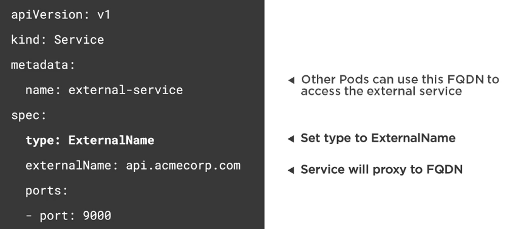

# Creating Services


## 1. Services Core Concepts

A service provides a single point of entry for accesing one or more Pods

Question: Since Pods live and die, can you rely on their IP?

Answer: No! That's why need Services - IP's change a lot.


The Role of Services


Calling Services


Services and Pod Load Balancing


## 2. Service Types

- ClusterIP: Expose the service on a cluster-internal IP (default)

- NodePort: Expose the service on each Node's IP at a static port

- LoadBalancer: Provision an external IP to act as a load balancer for the service

- ExternalName: Maps a service to a DNS name

### 2.1 ClusterIP Service

- Service IP is exposed internally within the cluster
- Only Pods within the cluster can talk to the Service


### 2.2 NodePort Service

- Exposes the Service on each Node's IP at a static port
- Allocates a port from a range (default is 30000-32767)
- Each Node proxies the allocated port


### 2.3 LoadBalancer Service

- Exposes a Service externally
- Useful when combined with a cloud provider's load balancer
- NodePort and ClusterIP Services are created
- Each Node proxies the allocated port


### 2.4 ExternalName Service

- Service that acts as an alias for an external service
- Allows a Service to act as the proxy for an external service
- External service details are hidden from cluster (easier to change)


## 3. Creating a Service with kubectl

Port Forwarding


Useful for debugging, analyze performance, etc

__Creating a Service with YAML__


__Defining a Service__


```yml
apiVersion: v1
kind: Service
metadata:
  name: nginx
  labels:
    app: nginx
spec:
  selector:
    app: nginx
  ports:
  - name: http
    port: 80
    targetPort: 80
```

__Connecting to a Service by it's DNS Name__


__Creating a NodePort Service__


__Creating a LoadBalancer Service__


__Creating an ExternalName Service__



## 4. Kubectl and Services

__Creating a Service__

Use the kubectl create command along with the --filename or -f switch

kubectl create -f file.service.yml

```shell
$ kubectl create -f nginx.service.yml

service/nginx created
```

__Updating a Service__

Assumes --save-config was used with create

kubectl apply -f file.service.yml

__Updating or creating a Service__

Use the kubectl apply command along with the --filename or -f switch

__Deleting a Service__

Use the kubectl delete command along with the --filename or -f switch

kubectl delete -f file.service.yml

```shell
$ kubectl delete -f nginx.service.yml

service/nginx deleted
```

__Testing a Service and Pod with curl

How can you quickly test if a Service and Pod is working?

Use kubectl exec to shell into a Pod/Container


## 5. Kubectl Services in Action

We will create three different nginx pods

### 5.1 Creation of a nginx using kubectl:

```shell
$ kubectl run myngnix-standalone --image=nginx:alpine

kubectl run --generator=deployment/apps.v1 is DEPRECATED and will be removed in a future version. Use kubectl run --generator=run-pod/v1 or kubectl create instead.
deployment.apps/myngnix-standalone created
```

### 5.2 Creation of a new pod using a pod yaml file

nginx.pod3.yaml

```yml
apiVersion: v1
kind: Pod
metadata:
  name: my-nginx
  labels:
    app: nginx
    rel: stable
spec:
  containers:
  - name: my-nginx
    image: nginx:alpine 
    ports:
    - containerPort: 80
    livenessProbe:
      httpGet:
        path: /index.html
        port: 80
      initialDelaySeconds: 15
      timeoutSeconds: 2 # Default is 1
      periodSeconds: 5 # Default is 10
      failureThreshold: 1 # Default is 3
    readinessProbe:
      httpGet:
        path: /index.html
        port: 80
      initialDelaySeconds: 3
      periodSeconds: 5 # Default is 10
      failureThreshold: 1 # Default is 3
    resources:
```

```shell
$ kubectl create -f nginx.pod.yml

pod/my-nginx created
```

## 5.3 Creation of a pod using a deployment yaml file

nginx.deployment.yml

```yml
apiVersion: apps/v1
kind: Deployment
metadata:
  name: frontend
  labels:
    app: my-nginx
    tier: frontend
spec: 
  replicas: 1
  selector:
    matchLabels:
      tier: frontend
  template:
    metadata:
      labels:
        tier: frontend
    spec:
      containers:
      - name: my-nginx
        image: nginx:alpine
        ports:
        - containerPort: 80
        resources:
          limits:
            memory: "128Mi" #128 MB
            cpu: "200m" #200 millicpu (.2 cpu or 20% of the cpu)
        livenessProbe:
          httpGet:
            path: /index.html
            port: 80
          initialDelaySeconds: 15
          timeoutSeconds: 2 # Default is 1
          periodSeconds: 5 # Default is 10
          failureThreshold: 1 # Default is 3
```

```shell
$ kubectl create -f nginx.deployment.yml

deployment.apps/frontend created
```

__Viewing the result__

```shell
$ kubectl get pods

frontend-689dcbd45c-g5btb            1/1     Running   0          6s
my-nginx                             1/1     Running   0          5m35s
myngnix-standalone-b789d4fc4-5rzt5   1/1     Running   0          9m11s

```

__Entering in the standalone pod and installing curl__

```shell
$ kubectl exec myngnix-standalone-b789d4fc4-5rzt5 -it sh

/ # apk add curl
fetch http://dl-cdn.alpinelinux.org/alpine/v3.10/main/x86_64/APKINDEX.tar.gz
fetch http://dl-cdn.alpinelinux.org/alpine/v3.10/community/x86_64/APKINDEX.tar.gz
(1/4) Installing ca-certificates (20190108-r0)
(2/4) Installing nghttp2-libs (1.39.2-r0)
(3/4) Installing libcurl (7.66.0-r0)
(4/4) Installing curl (7.66.0-r0)
Executing busybox-1.30.1-r3.trigger
Executing ca-certificates-20190108-r0.trigger
OK: 23 MiB in 40 packages
```

Exit and then, we will try to obtain the IP of some pod. There are couple ways we can do this.

We can use get or describe.

Using get:

```shell
$ kubectl get pod frontend-689dcbd45c-g5btb -o yaml

...
podIP: 172.18.0.8
...
```

Go back into the pod where we have been installed the curl:

```shell
$ kubectl exec myngnix-standalone-b789d4fc4-5rzt5 -it sh

/ # curl http://172.18.0.8
clusterIP.service.yml

<!DOCTYPE html>
<html>
<head>
<title>Welcome to nginx!</title>
<style>
    body {
        width: 35em;
        margin: 0 auto;
        font-family: Tahoma, Verdana, Arial, sans-serif;
    }
</style>
</head>
<body>
<h1>Welcome to nginx!</h1>
<p>If you see this page, the nginx web server is successfully installed and
working. Further configuration is required.</p>

<p>For online documentation and support please refer to
<a href="http://nginx.org/">nginx.org</a>.<br/>
Commercial support is available at
<a href="http://nginx.com/">nginx.com</a>.</p>

<p><em>Thank you for using nginx.</em></p>
</body>
</html>
/ #
```

It is working.

Now, we hace a service of ClusterIP type. This means that only will be accesible within the cluster. Very helpful when we want pods to talk to pods.

```yml
apiVersion: v1
kind: Service
metadata:
  name: nginx-clusterip
spec:
  type: ClusterIP 
  selector:
    app: my-nginx
  ports:
  - port: 8080
    targetPort: 80
```

```shell
$ apply -f clusterip.service.yml

service/nginx-clusterip created
```

```shell
$ get services

NAME              TYPE        CLUSTER-IP     EXTERNAL-IP   PORT(S)    AGE
kubernetes        ClusterIP   10.96.0.1      <none>        443/TCP    25h
nginx-clusterip   ClusterIP   10.108.8.115   <none>        8080/TCP   38s

```

Go back to the pod with the curl installed and try the cluster ip

```
/ # curl http://10.108.8.115:8080

<!DOCTYPE html>
<html>
<head>
<title>Welcome to nginx!</title>
<style>
    body {
        width: 35em;
        margin: 0 auto;
        font-family: Tahoma, Verdana, Arial, sans-serif;
    }
</style>
</head>
<body>
<h1>Welcome to nginx!</h1>
<p>If you see this page, the nginx web server is successfully installed and
working. Further configuration is required.</p>

<p>For online documentation and support please refer to
<a href="http://nginx.org/">nginx.org</a>.<br/>
Commercial support is available at
<a href="http://nginx.com/">nginx.com</a>.</p>

<p><em>Thank you for using nginx.</em></p>
</body>
</html>
```

The ClusterIP found the app: my-nginx. The deployment, and the pod contains this app name within.

You can try using the DNS name

```shell
/ # curl http://nginx-clusterip:8080

...
<<The same result>>
```

This is the way to test a pod using another pod with a curl installed within.

Delete the cluster ip 

```shell
$ kubectl delete service nginx-clusterip

service "nginx-clusterip" deleted
```

We now have a nodeport service in nodeport.service.yml

```yml
apiVersion: v1
kind: Service
metadata:
  name: nginx-nodeport
spec:
  type: NodePort
  selector:
    app: my-nginx
  ports:
  - port: 80
    targetPort: 80
    nodePort: 31000
```

```shell
$ kubectl apply -f nodeport.service.yml

service/nginx-nodeport created
```

Getting the services...

```shell
$ kubectl get services
NAME             TYPE        CLUSTER-IP    EXTERNAL-IP   PORT(S)        AGE
kubernetes       ClusterIP   10.96.0.1     <none>        443/TCP        26h
nginx            ClusterIP   10.98.48.43   <none>        80/TCP         10m
nginx-nodeport   NodePort    10.96.222.9   <none>        80:31000/TCP   37s

```

We can try in the browser: http://localhost:31000


