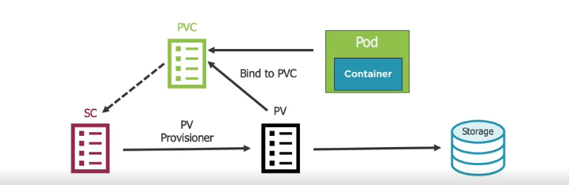

# Storage

We are here


### 1. Storage Core Concepts

Question: How do you store application state/data and exchange it between Pods with Kubernetes?

Answer: Volumes (although other data storage options exist)

A Volume can be used to hold data and state for Pods and containers


__Volumes and Volume Mounts__


__Volumes Type Examples__


__Volume Types__


__Defining an emptyDir Volume__


__Defining a hostPath Volume__


__Cloud Volumes__


Example of defining an Azure File Volume


Example of defining an AWS Volume


Example of defining an Google Cloud gcePersistentDisk Volume


__Viewing a Pod's Volumes__

Several different techniques can be used to view a Pod's Volumes

kubectl describe pod [pod-name]

kubectl get pod [pod-name] -o yaml

## 2. Volumes in action

### 2.1 Empty Dir

nginx-emptyDir.pod.yml

```yml
apiVersion: v1
kind: Pod
metadata:
  name: my-nginx
  labels:
    app: my-nginx
    rel: stable
spec:
  containers:
  - name: my-nginx
    image: nginx:alpine 
    ports:
    - containerPort: 80
    resources:
    volumeMounts:
    - name: html
      mountPath: /html
  volumes:
  - name: html
    emptyDir: {} # lifecycle tied to Pod
```

Start the pod:

```shell
$ kubectl apply -f nginx-emptyDir.pod.yml
```

The __emptyDir__ is a great solution for share termporary data if we have multiple containers in a pod.

### 2.2 Host Path

docker-hostPath.pod.yml

```yml
apiVersion: v1
kind: Pod
metadata:
  name: docker-volume
spec:
  containers:
  - name: docker
    image: docker
    command: ["sleep"]
    args: ["100000"]
    volumeMounts:
    - name: docker-socket
      mountPath: /var/run/docker.sock
    resources:
  volumes:
  - name: docker-socket
    hostPath:
      path: /var/run/docker.sock
      type: Socket

# Once Pod is created you can shell into it to run Docker commands:
# kubectl exec [pod-name] -it sh

# Valid Types of hostPath: DirectoryOrCreate, Directory, FileOrCreate, File, Socket, CharDevice, BlockDevice
```

Start the pod:

```shell
$ kubectl apply -f docker-hostPath.pod.yml
```

Entering in the container:

```shell
$ kubectl exec docker-volume -it sh

/ # docker
```

We are forwarding to the host docker daemon. We can execute docker ps, etc...

## 3. PersistentVolumes and PersistentVolumeClaims

__Defining a PV and PVC__


__Defnining a PersistentVolume for Azure__


And now, we have to create a PersistentVolumeClaim

__Defining a PersistentVolumeClaim__


Finally, we need to reference the PVC in the pod

__Using a PersistentVolumeClaim__


## 4. StorageClasses

A StorageClass (SC0) is a type of storage template that can be used to dynamically provision storage


### 4.1 StorageClass Workflow

1. Create Storage Class
2. Create PersistentVolumeClaim that references StorageClass
3. Kubernetes uses StorageClass provisioner to provision a PersistentVolume
4. Storage provisioned, PersistentVolume created and bound to PersistentVolumeClaim
5. Pod volume references PersistentVolumeClaim



### 4.2 Detail of manifests


## 5. PersistentVolumes in Action

In this example, we will use Kubernets StatefulSet.

This piece manages the deployment and scaling of a set of Pods, and provides guarantees about the ordering and uniqueness of these Pods.

View the mongo.deployment.yml for more detail

## 6. Summary


