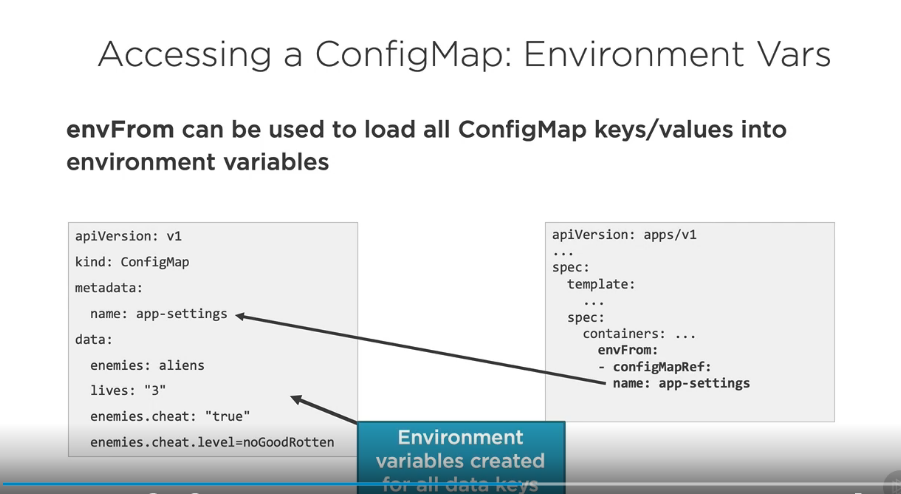
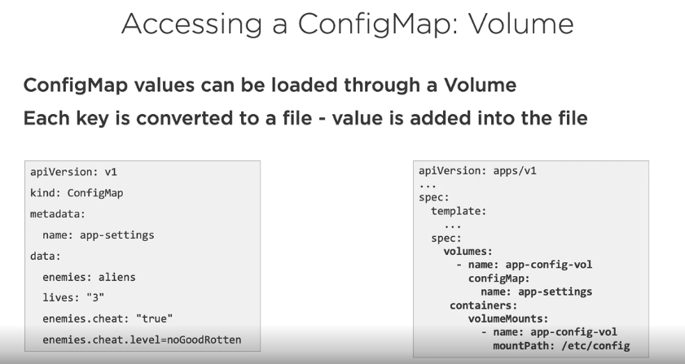

# ConfigMaps and Secrets

We are Here


## 1. ConfigMaps Core Concepts

ConfigMaps provide a way to store configuration information and provide it to containers.


__Accessing ConfigMap data in a Pod


## 1.1 Creating a ConfigMap

__Defining Values in a ConfigMap manifest__


__Defining Key/Value Pairs in a File__


__Defining a Key/Value Pairs in an Env File__


## 1.2 Using a ConfigMap

__Get a ConfigMap__


__Accessing a ConfigMap: Environment Vars__


envFrom can be used to load all ConfigMap keys/values into environment variables



__Accessing a ConfigMap: Volume__

ConfigMap values can be loaded through a Volume.
Each key is converted to a file - value is added into the file



## 2. Secret Core Concepts

A Secret is an object that contains a small amount of sensitive data such as a password, a token or a key.


### 2.1 Creating a Secret

Secrets can be created using kubectl create secret

```shell
# Create a secret and store securely in Kubernetes
kubectl create secret generic my-secret --from-literal=pwd=my-password

# Create a secret from a file
kubectl create secret generic my-secret
  -from-file=ssh-privatekey=~/.ssh/id_rsa
  -from-file=ssh-publickey=~/.ssh/id_rsa.pub

# Create a secret from a key pair
kubectl create secret tls tls-secret 
  --cert=path/to/tls.cert 
  --key=path/to/tls.ley
```

__Question:__ Can I declaratively define secrets using YAML?

__Answer:__ Yes - but any secret data is only base64 encoded in the manifest file!


### 2.2 Using a Secret

__Getting the secrets__


