# Helm

Helm is the first application package manager running atop Kubernetes. It allows describing the application structure through convenient helm-charts and managing it with simple commands.

## 1. Typical application

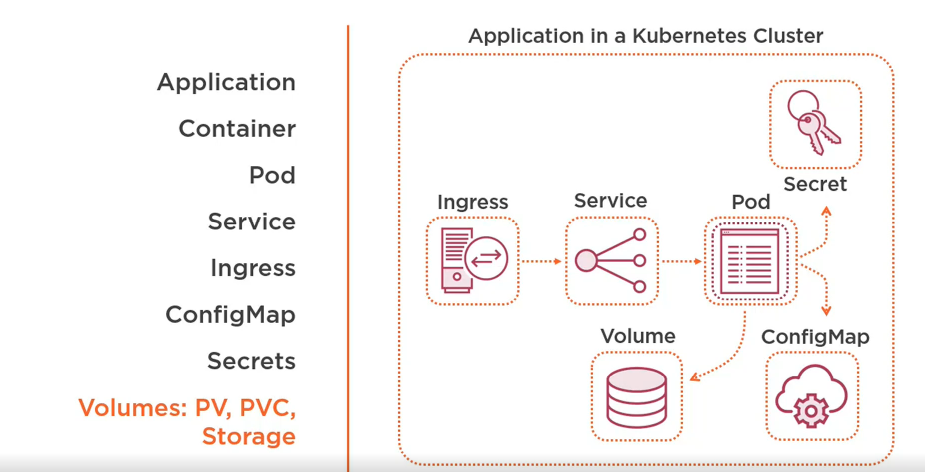

__Manually approach__

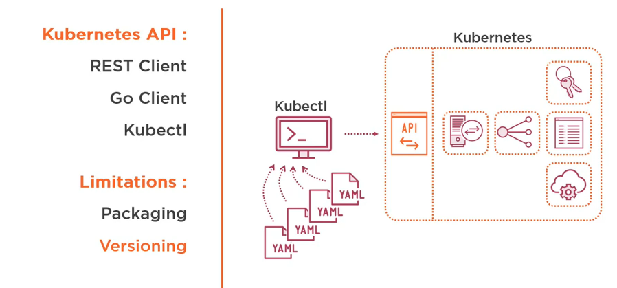

Helm is a package manager

__Analogy with Other Package Managers__

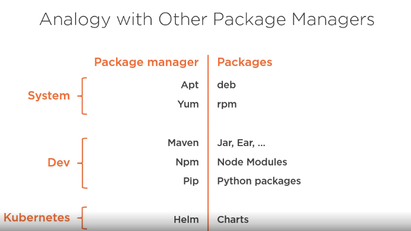

__How it Works__

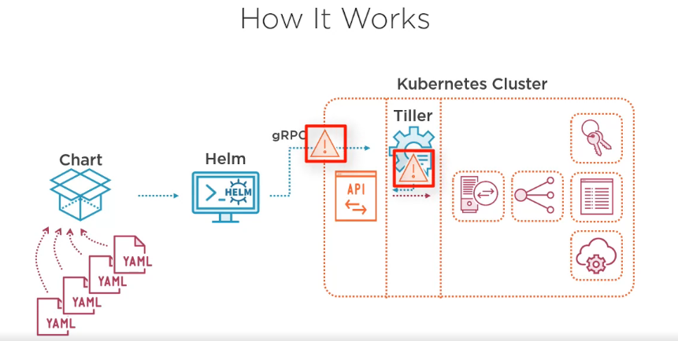

__Helm Features__

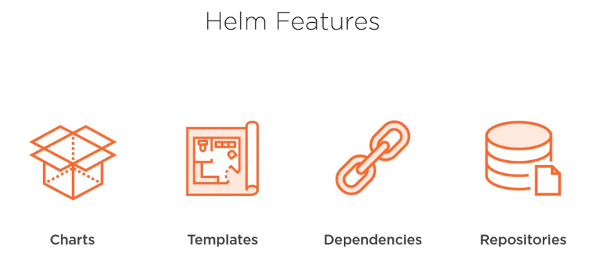

## 2. Installation

### 2.1 Installing Helm and Tiller

Helm: A command line tool
Tiller: A server side component tutor running in a pod in the Kubernetes Cluster

The installation instructions are in https://helm.sh/docs/

The helm repository is: https://github.com/helm/helm/releases

We will install the version 2 of Helm, the 2.16.5. Download it to your local machine.

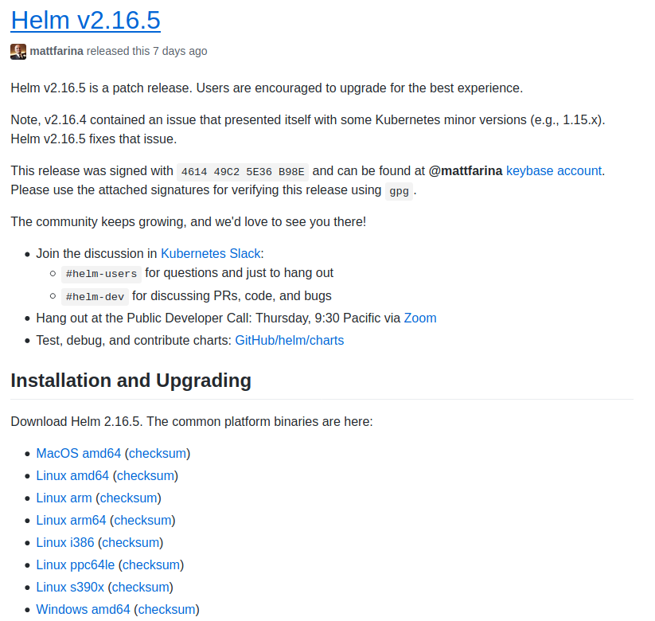

For Ubuntu 18.04 we have downloaded this file: helm-v2.16.5-linux-amd64.tar.gz and extract it.

```shell
$ curl -LO https://storage.googleapis.com/kubernetes-helm/helm-v2.16.5-linux-amd64.tar.gz

% Total    % Received % Xferd  Average Speed   Time    Time     Time  Current
                                 Dload  Upload   Total   Spent    Left  Speed
100 24.1M  100 24.1M    0     0  5437k      0  0:00:04  0:00:04 --:--:-- 6103k
```

Decompress it

```shell
$ tar -zxvf helm-v2.16.5-linux-amd64.tar.gz

linux-amd64/
linux-amd64/README.md
linux-amd64/tiller
linux-amd64/helm
linux-amd64/LICENSE
```

Copy it to our bin folder

```shell
$ sudo mv linux-amd64/helm /usr/local/bin/helm
```

And test it

```shell
$ helm version --short

Client: v2.16.5+g89bd14c
Error: Get https://127.0.0.1:32768/api/v1/namespaces/kube-system/pods?labelSelector=app%3Dhelm%2Cname%3Dtiller: dial tcp 127.0.0.1:32768: connect: connection refused
```

Start minikube if you get this message, and try again

```shell
$ minikube start

😄  minikube v1.8.2 on Ubuntu 18.04
✨  Using the docker driver based on existing profile
⌛  Reconfiguring existing host ...
🔄  Starting existing docker container for "minikube" ...
🐳  Preparing Kubernetes v1.17.3 on Docker 19.03.2 ...
    ▪ kubeadm.pod-network-cidr=10.244.0.0/16
🚀  Launching Kubernetes ... 
🌟  Enabling addons: dashboard, default-storageclass, metrics-server, storage-provisioner
🏄  Done! kubectl is now configured to use "minikube"

helm version --short

Client: v2.16.5+g89bd14c
Error: could not find tiller
```

The message indicates us that helm can connect to kubernetes (our running minikube) and tiller can not be found.

First, we obtain the kubectl config

```shell
$ kubectl config view

apiVersion: v1
clusters:
- cluster:
    certificate-authority: /home/diego/.minikube/ca.crt
    server: https://127.0.0.1:32768
  name: minikube
contexts:
- context:
    cluster: minikube
    user: minikube
  name: minikube
current-context: minikube
kind: Config
preferences: {}
users:
- name: minikube
  user:
    client-certificate: /home/diego/.minikube/client.crt
    client-key: /home/diego/.minikube/client.key
```

The current-context is __minikube__

Init helm executing:

```shell
$ helm init

Creating /home/diego/.helm 
Creating /home/diego/.helm/repository 
Creating /home/diego/.helm/repository/cache 
Creating /home/diego/.helm/repository/local 
Creating /home/diego/.helm/plugins 
Creating /home/diego/.helm/starters 
Creating /home/diego/.helm/cache/archive 
Creating /home/diego/.helm/repository/repositories.yaml 
Adding stable repo with URL: https://kubernetes-charts.storage.googleapis.com 
Adding local repo with URL: http://127.0.0.1:8879/charts 
$HELM_HOME has been configured at /home/diego/.helm.

Tiller (the Helm server-side component) has been installed into your Kubernetes Cluster.

Please note: by default, Tiller is deployed with an insecure 'allow unauthenticated users' policy.
To prevent this, run `helm init` with the --tiller-tls-verify flag.
For more information on securing your installation see: https://v2.helm.sh/docs/securing_installation/
```

This will install tiller on our minikube, and we can obtain a message showing the security problems.

```shell
$ helm version --short

Client: v2.16.5+g89bd14c
Server: v2.16.5+g89bd14c
```

NOTE: It can take one minute or more deploying the tiller artifacts

```shell
$ kubectl get all --namespace=kube-system -l name=tiller

NAME                                 READY   STATUS    RESTARTS   AGE
pod/tiller-deploy-5ffd586995-rb55w   1/1     Running   0          4m3s

NAME                    TYPE        CLUSTER-IP      EXTERNAL-IP   PORT(S)     AGE
service/tiller-deploy   ClusterIP   10.108.191.21   <none>        44134/TCP   4m3s

NAME                            READY   UP-TO-DATE   AVAILABLE   AGE
deployment.apps/tiller-deploy   1/1     1            1           4m3s

NAME                                       DESIRED   CURRENT   READY   AGE
replicaset.apps/tiller-deploy-5ffd586995   1         1         1       4m3s
```

Try to install nginx-demo using helm

```shell
$ helm create nginx-demo

helm create nginx-demo
```

```shell
$ helm install nginx-demo

NAME:   austere-hydra
LAST DEPLOYED: Thu Apr  2 18:23:03 2020
NAMESPACE: default
STATUS: DEPLOYED

RESOURCES:
==> v1/Deployment
NAME                      READY  UP-TO-DATE  AVAILABLE  AGE
austere-hydra-nginx-demo  0/1    1           0          0s

==> v1/Pod(related)
NAME                                       READY  STATUS             RESTARTS  AGE
austere-hydra-nginx-demo-686bb5868c-h8mkn  0/1    ContainerCreating  0         0s

==> v1/Service
NAME                      TYPE       CLUSTER-IP     EXTERNAL-IP  PORT(S)  AGE
austere-hydra-nginx-demo  ClusterIP  10.110.109.75  <none>       80/TCP   0s

==> v1/ServiceAccount
NAME                      SECRETS  AGE
austere-hydra-nginx-demo  1        0s


NOTES:
1. Get the application URL by running these commands:
  export POD_NAME=$(kubectl get pods --namespace default -l "app.kubernetes.io/name=nginx-demo,app.kubernetes.io/instance=austere-hydra" -o jsonpath="{.items[0].metadata.name}")
  echo "Visit http://127.0.0.1:8080 to use your application"
  kubectl port-forward $POD_NAME 8080:80
```

### 2.3. Configuring Helm Security

In Production environment we need to secure tiller.

- Configuring Tiller Service Account
- Configuring SSL between Helm and Tiller

#### 2.3.1 Configuring Tiller Service Account

By default, Tiller has rights over all kubernetes cluster. This may be valid in Dev or Integration environment, but not in Production environments.

Using a Tiller Service Account, we restrict this permissions to a kubernetes namespace.

First, delete the previous installation of Tiller

```shell
$ helm reset

Tiller (the Helm server-side component) has been uninstalled from your Kubernetes Cluster.
```

NOTE: use helm reset --force if we have a release running in our cluster.

We use the next three files:

tiller-serviceaccount.yaml

```yml
apiVersion: v1
kind: ServiceAccount
metadata:
  name: tiller
  namespace: lab
```

tiller-role.yaml

```yml
apiVersion: rbac.authorization.k8s.io/v1
kind: Role
metadata:
  name: tiller-role 
  namespace: lab
rules:
  - apiGroups: ["", "extensions", "apps"]
    resources: ["*"]
    verbs: ["*"]
  - apiGroups: ["batch"]
    resources:
      - jobs
      - cronjobs
    verbs: ["*"]
```

tiller-rolebinding.yaml

```yml
apiVersion: rbac.authorization.k8s.io/v1
kind: RoleBinding
metadata:
  name: tiller-role-binding 
  namespace: lab
subjects:
  - kind: ServiceAccount
    name: tiller
    namespace: lab
roleRef:
  kind: Role 
  name: tiller-role 
  apiGroup: rbac.authorization.k8s.io
```

Creating the lab namespace

```shell
$ kubectl create namespace lab

namespace/lab created
```

Then, creating the serviceaccount

```shell
$ kubectl create -f tiller-serviceaccount.yaml

serviceaccount/tiller created
```

The role

```shell
$ kubectl create -f tiller-role.yaml

role.rbac.authorization.k8s.io/tiller-role created
```

And finally, the role binding

```shell
$ kubectl create -f tiller-rolebinding.yaml

rolebinding.rbac.authorization.k8s.io/tiller-role-binding created
```

Initialize now helm with these parameters:

```shell
$ helm init --service-account tiller --tiller-namespace lab

$HELM_HOME has been configured at /home/diego/.helm.

Tiller (the Helm server-side component) has been installed into your Kubernetes Cluster.

Please note: by default, Tiller is deployed with an insecure 'allow unauthenticated users' policy.
To prevent this, run `helm init` with the --tiller-tls-verify flag.
For more information on securing your installation see: https://v2.helm.sh/docs/securing_installation/
```

Checking that tiller was deployed in the lab namespace

```shell
$ kubectl get all --namespace=lab

NAME                                 READY   STATUS    RESTARTS   AGE
pod/tiller-deploy-5596dcb5f7-qrsv9   1/1     Running   0          70s

NAME                    TYPE        CLUSTER-IP       EXTERNAL-IP   PORT(S)     AGE
service/tiller-deploy   ClusterIP   10.111.201.163   <none>        44134/TCP   70s

NAME                            READY   UP-TO-DATE   AVAILABLE   AGE
deployment.apps/tiller-deploy   1/1     1            1           70s

NAME                                       DESIRED   CURRENT   READY   AGE
replicaset.apps/tiller-deploy-5596dcb5f7   1         1         1       70s
```

And try to install a test in the lab namespace:

```shell
$ helm create test

creating test

$ helm install test --tiller-namespace=lab --namespace=lab

NAME:   snug-quoll
LAST DEPLOYED: Thu Apr  2 18:49:39 2020
NAMESPACE: lab
STATUS: DEPLOYED

RESOURCES:
==> v1/Deployment
NAME             READY  UP-TO-DATE  AVAILABLE  AGE
snug-quoll-test  0/1    0           0          0s

==> v1/Pod(related)
NAME                              READY  STATUS             RESTARTS  AGE
snug-quoll-test-769b56487b-878hr  0/1    ContainerCreating  0         0s

==> v1/Service
NAME             TYPE       CLUSTER-IP     EXTERNAL-IP  PORT(S)  AGE
snug-quoll-test  ClusterIP  10.110.208.59  <none>       80/TCP   0s

==> v1/ServiceAccount
NAME             SECRETS  AGE
snug-quoll-test  1        0s


NOTES:
1. Get the application URL by running these commands:
  export POD_NAME=$(kubectl get pods --namespace lab -l "app.kubernetes.io/name=test,app.kubernetes.io/instance=snug-quoll" -o jsonpath="{.items[0].metadata.name}")
  echo "Visit http://127.0.0.1:8080 to use your application"
  kubectl port-forward $POD_NAME 8080:80
```

If we try to install in the default namespace, we will obtain the next error:

```shell
$ helm install test --tiller-namespace=lab --namespace=default

Error: release lumpy-wallaby failed: namespaces "default" is forbidden: User "system:serviceaccount:lab:tiller" cannot get resource "namespaces" in API group "" in the namespace "default"
```

#### 2.3.2 Configuring SSL between Helm and Tiller

The helm documentation describes how to add SSL (certificates and keys in the two sides) for grpccommunication between Helm and Tiller.

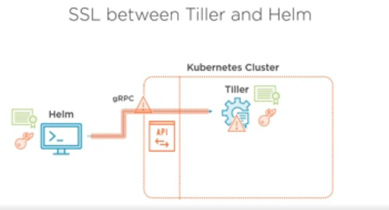

#### 2.3.3 Alternatives

Alternatives to securize Tiller:

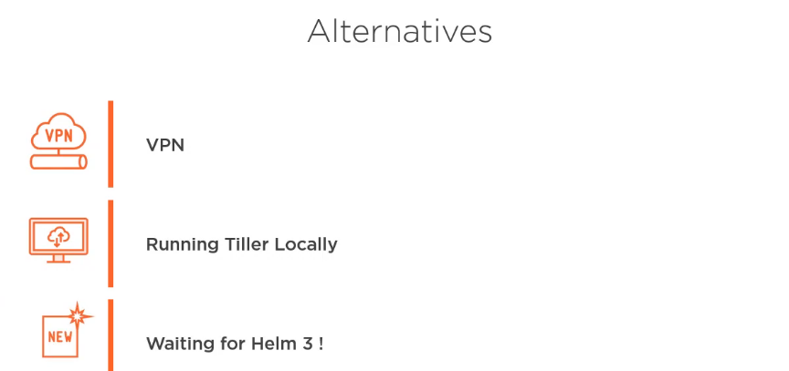

Using Tiller locally, the communication is private to our local machine

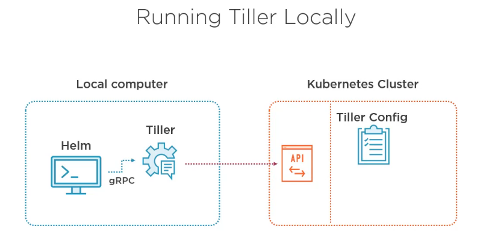

Installing Tiller locally:

Decompress again the tiller package:

```shell
$ tar -zxvf helm-v2.16.5-linux-amd64.tar.gz

linux-amd64/
linux-amd64/README.md
linux-amd64/tiller
linux-amd64/helm
linux-amd64/LICENSE
```

We need to install linux-amd64/tiller folder in our bin folder

```shell
$ sudo mv linux-amd64/tiller /usr/local/bin
```

Start the tiller server

```shell
$ tiller

[main] 2020/04/02 19:05:07 Starting Tiller v2.16.5 (tls=false)
[main] 2020/04/02 19:05:07 GRPC listening on :44134
[main] 2020/04/02 19:05:07 Probes listening on :44135
[main] 2020/04/02 19:05:07 Storage driver is ConfigMap
[main] 2020/04/02 19:05:07 Max history per release is 0
```

Leave the server running and moveto another terminal and copy the helm folder

```shell
$ sudo mv linux-amd64/helm /usr/local/bin/helm
```

Init the helm with the flag --client-only

```shell
$ helm init --client-only

$HELM_HOME has been configured at /home/diego/.helm.
Not installing Tiller due to 'client-only' flag having been set
```

Export the next variable:

```shell
$ export HELM_HOME=/home/me/.helm
```

Check the installation

```shell
$ helm version --short

Client: v2.16.5+g89bd14c
Error: could not find tiller
```

Fix the missing tiller

```shell
$ export HELM_HOST=localhost:44134
```

Check

```shell
$ helm version --short

Client: v2.16.5+g89bd14c
Server: v2.16.5+g89bd14c
```

Try this test:

```shell
$ helm create nginx-localtiller-demo

Creating nginx-localtiller-demo
```

And install it

```shell
$ helm install nginx-localtiller-demo

NAME:   riotous-snail
LAST DEPLOYED: Thu Apr  2 19:12:35 2020
NAMESPACE: default
STATUS: DEPLOYED

RESOURCES:
==> v1/Deployment
NAME                                  READY  UP-TO-DATE  AVAILABLE  AGE
riotous-snail-nginx-localtiller-demo  0/1    1           0          0s

==> v1/Pod(related)
NAME                                                   READY  STATUS             RESTARTS  AGE
riotous-snail-nginx-localtiller-demo-6b458ccbc8-4fs5s  0/1    ContainerCreating  0         0s

==> v1/Service
NAME                                  TYPE       CLUSTER-IP     EXTERNAL-IP  PORT(S)  AGE
riotous-snail-nginx-localtiller-demo  ClusterIP  10.104.239.39  <none>       80/TCP   0s

==> v1/ServiceAccount
NAME                                  SECRETS  AGE
riotous-snail-nginx-localtiller-demo  1        0s


NOTES:
1. Get the application URL by running these commands:
  export POD_NAME=$(kubectl get pods --namespace default -l "app.kubernetes.io/name=nginx-localtiller-demo,app.kubernetes.io/instance=riotous-snail" -o jsonpath="{.items[0].metadata.name}")
  echo "Visit http://127.0.0.1:8080 to use your application"
  kubectl port-forward $POD_NAME 8080:80
```

```shell
$ kubectl get all | grep localtiller

pod/riotous-snail-nginx-localtiller-demo-6b458ccbc8-4fs5s   1/1     Running   0          73s
service/riotous-snail-nginx-localtiller-demo   ClusterIP   10.104.239.39   <none>        80/TCP    73s
deployment.apps/riotous-snail-nginx-localtiller-demo   1/1     1            1           73s
replicaset.apps/riotous-snail-nginx-localtiller-demo-6b458ccbc8   1         1         1       73s
```

There is no tiller pod anymore, but the tiller configuration is still stored in Config Map on the server side, which is good for the persistence

```shell
$ kubectl get configmaps --namespace=kube-system

austere-hydra.v1                     1      53m
coredns                              2      16d
extension-apiserver-authentication   6      16d
kube-proxy                           2      16d
kubeadm-config                       2      16d
kubelet-config-1.17                  1      16d
riotous-snail.v1                     1      3m46s
```

NOTE: In Helm 3 there is no tiller!!!

### 2.4 Cleaning Helm

- Deleting Releases
- Deleting Tiller configuration
- Limiting Tiller configuration
- Deleting Tiller
- Deleting Helm local files

__Deleting Releases__

```shell
$ helm list

NAME            REVISION        UPDATED                         STATUS          CHART                             APP VERSION     NAMESPACE
austere-hydra   1               Thu Apr  2 18:23:03 2020        DEPLOYED        nginx-demo-0.1.0                  1.0             default  
riotous-snail   1               Thu Apr  2 19:12:35 2020        DEPLOYED        nginx-localtiller-demo-0.1.0      1.0             default  
```

```shell
$ helm delete austere-hydra

release "austere-hydra" deleted

$ helm delete riotous-snail

release "riotous-snail" deleted
```
__Deleting Tiller configuration__

The config mapas were not been deleted, we need to use the --purge flag

```shell
$ kubectl get configmaps --namespace=kube-system

austere-hydra.v1                     1      60m
coredns                              2      16d
extension-apiserver-authentication   6      16d
kube-proxy                           2      16d
kubeadm-config                       2      16d
kubelet-config-1.17                  1      16d
riotous-snail.v1                     1      11m

$ helm delete austere-hydra --purge

release "austere-hydra" deleted

$ helm delete riotous-snail --purge

release "riotous-snail" deleted
```

And then:

```shell
$ kubectl get configmaps --namespace=kube-system

coredns                              2      16d
extension-apiserver-authentication   6      16d
kube-proxy                           2      16d
kubeadm-config                       2      16d
kubelet-config-1.17                  1      16d
```

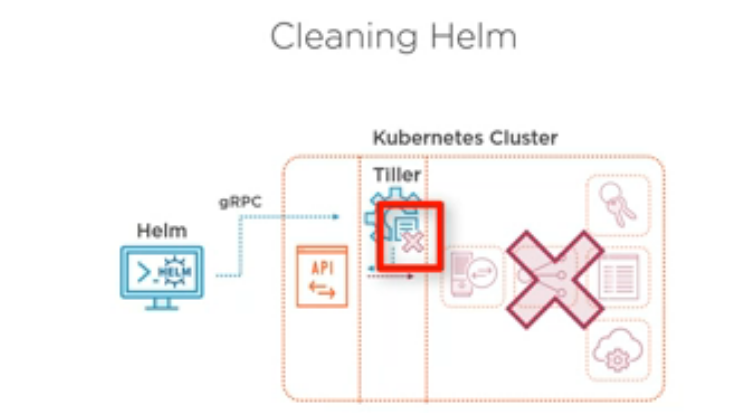

__Limiting Tiller configuration__

The config maps will be grow very much in our environments if we do not delete the older versions.

For this, this command can help us:

```shell
$ helm init --history-max 200
```

__Deleting Tiller__

If you want to delete Tiller's pod, service and deployment, you can execute:

```shell
$ helm reset

Tiller (the Helm server-side component) has been uninstalled from your Kubernetes Cluster.
```

This only will delete the server side. 

__Deleting Helm local files__

for deleting the local side, execute:

```shell
$ ls /home/<<user>>/.helm

cache  plugins  repository  starters
```

```shell
$ rm -rf /home/<<user>>/.helm
$ sudo rm /usr/local/bin/helm

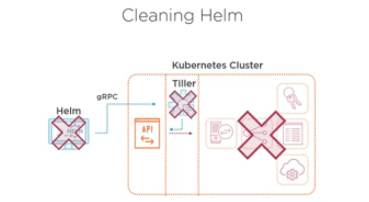
