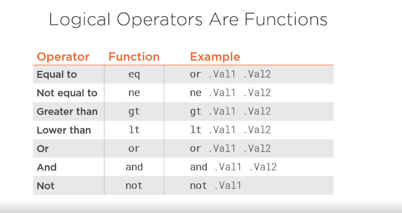
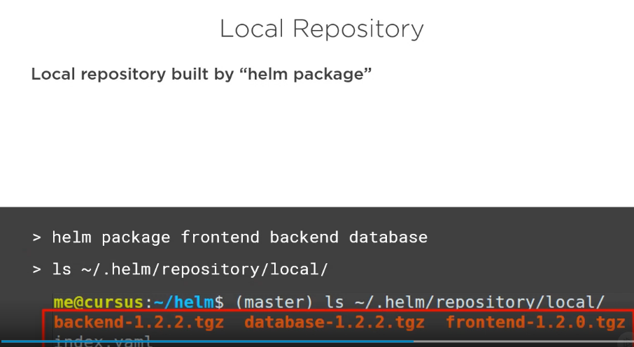
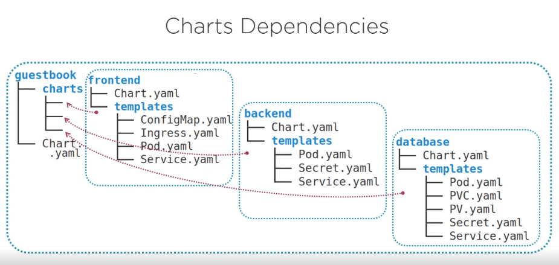
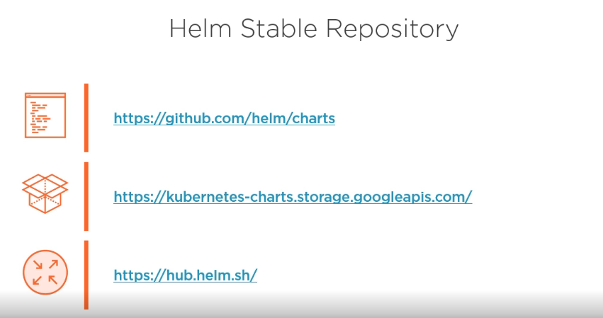

# Advanced Helm

## 1. Customizing Charts with Helm Templates

__Why we need Helm Templates?__

The change of values such as image version, app version, etc hardcoded is not a good practice. Because of this, is neccesary the use of a templating engine that do this work for us automatically.

Also, if we want to install two version of the same application, we need to use different names for the app artifacts.


__Helm Template Engine__


Helm Template Engine is actually based on Go Template Engine. The values used in Helm Template Engine are coming from different sources.


__Helm Template Execution__


The values used can be get using:

```
$ helm get <<release-name>>
```

This values are in the tiller configmap, bat are shown hardcoded

__Helm Template Values__


__Helm Template Built-in Objects__


__Helm Template Example__


__Values and Sub Charts__


__Global Values__


__Example__

View the example at guestbook_secondVersion_Templating folder

View the maninfest of the template:

```shell
$ helm template guestbook

---
# Source: guestbook/charts/backend/templates/backend-secret.yaml
apiVersion: v1
kind: Secret
metadata:
  name: release-name-backend-secret 
data:
  mongodb-uri: bW9uZ29kYjovL2FkbWluOnBhc3N3b3JkQG1vbmdvZGI6MjcwMTcvZ3Vlc3Rib29rP2F1dGhTb3VyY2U9YWRtaW4=
---

...
...
```

Check the manifest, viewing the computed values and the final manifest generated.

```shell
$ helm install guestbook --dry-run --debug

[debug] Created tunnel using local port: '39383'

[debug] SERVER: "127.0.0.1:39383"

[debug] Original chart version: ""
[debug] CHART PATH: /home/diego/workdir/laboratories/kubernetes_lab/08-Advanced Helm/guestbook_secondVersion_Templating/guestbook

NAME:   dealing-jaguar
REVISION: 1
RELEASED: Mon Apr  6 12:25:30 2020
CHART: guestbook-1.2.0
USER-SUPPLIED VALUES:
{}

COMPUTED VALUES:
backend:
  global: {}
  image:
    repository: phico/backend
    tag: "2.0"
  ingress:
    host: backend.minikube.local
  replicaCount: 1
  secret:
    mongodb_uri: bW9uZ29kYjovL2FkbWluOnBhc3N3b3JkQG1vbmdvZGI6MjcwMTcvZ3Vlc3Rib29rP2F1dGhTb3VyY2U9YWRtaW4=
  service:
    port: 80
    type: ClusterIP
database:
  global: {}
  secret:
    mongodb_password: cGFzc3dvcmQ=
    mongodb_username: YWRtaW4=
  service:
    port: 80
    type: NodePort
  volume:
    storage: 100Mi

...
...
---
# Source: guestbook/charts/backend/templates/backend-secret.yaml
apiVersion: v1
kind: Secret
metadata:
  name: dealing-jaguar-backend-secret 
data:
  mongodb-uri: bW9uZ29kYjovL2FkbWluOnBhc3N3b3JkQG1vbmdvZGI6MjcwMTcvZ3Vlc3Rib29rP2F1dGhTb3VyY2U9YWRtaW4=
...
...

```

You can use helm lint to debug the bugs apply good practices.

Finally, install it with:

```shell
$ helm install guestbook

NAME:   jaundiced-dragonfly
LAST DEPLOYED: Mon Apr  6 12:29:28 2020
NAMESPACE: default
STATUS: DEPLOYED

RESOURCES:
==> v1/ConfigMap
NAME                                 DATA  AGE
jaundiced-dragonfly-frontend-config  2     0s

==> v1/Deployment
NAME                          READY  UP-TO-DATE  AVAILABLE  AGE
jaundiced-dragonfly-backend   0/1    1           0          0s
jaundiced-dragonfly-database  0/1    1           0          0s
jaundiced-dragonfly-frontend  0/1    1           0          0s

==> v1/PersistentVolume
NAME                             CAPACITY  ACCESS MODES  RECLAIM POLICY  STATUS  CLAIM                                     STORAGECLASS  REASON  AGE
jaundiced-dragonfly-database-pv  100Mi     RWO           Retain          Bound   default/jaundiced-dragonfly-database-pvc  manual        0s

==> v1/PersistentVolumeClaim
NAME                              STATUS  VOLUME                           CAPACITY  ACCESS MODES  STORAGECLASS  AGE
jaundiced-dragonfly-database-pvc  Bound   jaundiced-dragonfly-database-pv  100Mi     RWO           manual        0s

==> v1/Pod(related)
NAME                                           READY  STATUS   RESTARTS  AGE
jaundiced-dragonfly-database-688c556496-2wf9r  0/1    Pending  0         1s
jaundiced-dragonfly-database-688c556496-2wf9r  0/1    Pending  0         1s
jaundiced-dragonfly-database-688c556496-2wf9r  0/1    Pending  0         1s

==> v1/Secret
NAME                                 TYPE    DATA  AGE
jaundiced-dragonfly-backend-secret   Opaque  1     0s
jaundiced-dragonfly-database-secret  Opaque  2     0s

==> v1/Service
NAME                          TYPE       CLUSTER-IP     EXTERNAL-IP  PORT(S)    AGE
jaundiced-dragonfly-backend   ClusterIP  10.104.28.88   <none>       80/TCP     0s
jaundiced-dragonfly-database  ClusterIP  10.96.35.207   <none>       27017/TCP  0s
jaundiced-dragonfly-frontend  ClusterIP  10.105.135.64  <none>       80/TCP     0s

==> v1beta1/Ingress
NAME                                  HOSTS                    ADDRESS  PORTS  AGE
jaundiced-dragonfly-backend-ingress   backend.minikube.local   80       0s
jaundiced-dragonfly-frontend-ingress  frontend.minikube.local  80       0s
```

## 2. Adding Logic to Helm Template


__Using Functions and Pipelines__


Example of default pipeline use case


Functions and Pipelines


Main functions available


Example of trunc & trimSuffix


Example of b64enc & quote


Modifying Scope using With


Controlling Whitespaces and Indents


Logical Operators




Flow Control


Variables


Calling Helper Functions and Sub-templates


Notes.txt


## 3. Managing dependencies

__Packaging a Chart__


__Publishing Charts in Repositories__





__Defining Dependencies__



We need to manage the internal versions of the packages, using the requirements.yaml file


__Adding Conditions & Tags__

Using conditions and tags to select what will be installed.


__Using Existing Helm Charts__




Using the Command Line


__Customizing Existing Charts__

There are two ways:


