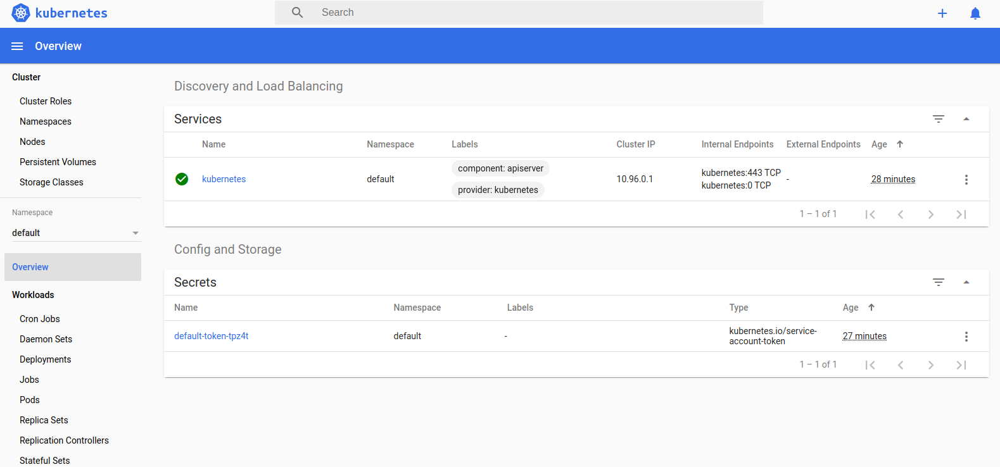

# Main Laboratory of Kubernetes

## 1. Minikube Install on Ubuntu 18.04 LTS

NOTE: Execute with a superuser the steps

Original Source of the manual: https://www.howtoforge.com/tutorial/how-to-install-kubernetes-with-minikube-on-ubuntu-1804-lts/

### 1.1 Update & Upgrade your environment

```shell
$ apt-get update -y
```

```shell
$ apt-get upgrade -y
```

### 1.2 Install VirtualBox Hypervisor

Minikube supports both KVM and VirtualBox hypervisor. So, you will need to install VirtualBox or KVM to your system.

You can install Virtualbox with the following command:

```shell
$ sudo apt-get install virtualbox virtualbox-ext-pack
```

### 1.3 Install Minikube

First, you will need to download the latest version of Minikube to your system. You can download it from their official websites with the following command:

```shell
$ wget https://storage.googleapis.com/minikube/releases/latest/minikube-linux-amd64
```

Once the download is completed, copy the downloaded file under /usr/local/bin with the following command:

```shell
$ cp minikube-linux-amd64 /usr/local/bin/minikube
```

Next, give execution permission to the minikube with the following command:

```shell
$ chmod 755 /usr/local/bin/minikube
```

Next, check the version of Minikube with the following command:

```shell
$ minikube version

minikube version: v1.8.2
commit: eb13446e786c9ef70cb0a9f85a633194e62396a1
```

### 1.4 Install Kubectl

Kubectl is a tool to deploy and manage applications on Kubernetes. By default, Kubectl is not available in the Ubuntu 18.04 default repository. So, you will need to add Kubernetes repository to your system.

First, download and add the GPG key with the following command:

```shell
$ curl -s https://packages.cloud.google.com/apt/doc/apt-key.gpg | apt-key add -
```

Next, add Kubernetes apt repository with the following command:

```shell
$ echo "deb http://apt.kubernetes.io/ kubernetes-xenial main" | tee /etc/apt/sources.list.d/kubernetes.list
```
Next, update the repository and install Kubectl with the following command:

```shell
$ apt-get update -y
$ apt-get install kubectl -y
```

Once the Kubectl has been installed, you can check the version using the following command:

```shell
$ kubectl version -o json

{
  "clientVersion": {
    "major": "1",
    "minor": "13",
    "gitVersion": "v1.13.4",
    "gitCommit": "c27b913fddd1a6c480c229191a087698aa92f0b1",
    "gitTreeState": "clean",
    "buildDate": "2019-02-28T13:37:52Z",
    "goVersion": "go1.11.5",
    "compiler": "gc",
    "platform": "linux/amd64"
  }
}
```

## 2. Start Minikube

All the required packages are installed. You can now start Minikube with the following command:

```shell
$ minikube start

😄  minikube v1.8.2 on Ubuntu 18.04
✨  Automatically selected the docker driver. Other choices: virtualbox, none
💾  Downloading preloaded images tarball for k8s v1.17.3 ...
    > preloaded-images-k8s-v1-v1.17.3-docker-overlay2.tar.lz4: 499.26 MiB / 499
🔥  Creating Kubernetes in docker container with (CPUs=2) (8 available), Memory=5900MB (23991MB available) ...
🐳  Preparing Kubernetes v1.17.3 on Docker 19.03.2 ...
    ▪ kubeadm.pod-network-cidr=10.244.0.0/16
🚀  Launching Kubernetes ... 
🌟  Enabling addons: default-storageclass, storage-provisioner
⌛  Waiting for cluster to come online ...
🏄  Done! kubectl is now configured to use "minikube"

```

You can now check the cluster status with the following command:

```shell
$ kubectl cluster-info

Kubernetes master is running at https://127.0.0.1:32768
KubeDNS is running at https://127.0.0.1:32768/api/v1/namespaces/kube-system/services/kube-dns:dns/proxy

To further debug and diagnose cluster problems, use 'kubectl cluster-info dump'.

```

You can also check the Kubectl default configuration with the following command:

```shell
$ kubectl config view

apiVersion: v1
clusters:
- cluster:
    certificate-authority: /root/.minikube/ca.crt
    server: https://192.168.99.100:8443
  name: minikube
contexts:
- context:
    cluster: minikube
    user: minikube
  name: minikube
current-context: minikube
kind: Config
preferences: {}
users:
- name: minikube
  user:
    client-certificate: /root/.minikube/client.crt
    client-key: /root/.minikube/client.key

```

To check the running nodes, run the following command:

```shell
$ kubectl get nodes

NAME   STATUS   ROLES    AGE   VERSION
m01    Ready    master   22m   v1.17.3
```

You can also access the Minikube Virtualbox with the following command:

```shell
$ minikube ssh

docker@minikube:~$
```

Now, exit from the Virtualbox shell:

```shell
$ exit

logout
```

You can also stop and delete kubernetes cluster anytime with the following command:

```shell
$ minikube stop

$ minikube delete
```

You can check the status of Minikube with the following command:

```shell
$ minikube status

host: Running
kubelet: Running
apiserver: Running
kubeconfig: Configured
```

## 3. Access Kubernetes Dashboard

By default, Kubernetes comes with web dashboard that can be used to manage your cluster.

You can list all the minikube addons with the following command:

```shell
$ minikube addons list

|-----------------------------|----------|--------------|
|         ADDON NAME          | PROFILE  |    STATUS    |
|-----------------------------|----------|--------------|
| dashboard                   | minikube | enabled ✅   |
| default-storageclass        | minikube | enabled ✅   |
| efk                         | minikube | disabled     |
| freshpod                    | minikube | disabled     |
| gvisor                      | minikube | disabled     |
| helm-tiller                 | minikube | disabled     |
| ingress                     | minikube | disabled     |
| ingress-dns                 | minikube | disabled     |
| istio                       | minikube | disabled     |
| istio-provisioner           | minikube | disabled     |
| logviewer                   | minikube | disabled     |
| metrics-server              | minikube | disabled     |
| nvidia-driver-installer     | minikube | disabled     |
| nvidia-gpu-device-plugin    | minikube | disabled     |
| registry                    | minikube | disabled     |
| registry-creds              | minikube | disabled     |
| storage-provisioner         | minikube | enabled ✅   |
| storage-provisioner-gluster | minikube | disabled     |
|-----------------------------|----------|--------------|
```

Next, list all the container image running in the cluster with the following command:

```shell
$ kubectl get pods --all-namespaces

NAMESPACE              NAME                                         READY   STATUS    RESTARTS   AGE
kube-system            coredns-6955765f44-2x55j                     1/1     Running   0          25m
kube-system            coredns-6955765f44-fcc68                     1/1     Running   0          25m
kube-system            etcd-m01                                     1/1     Running   0          25m
kube-system            kindnet-2xjgr                                1/1     Running   0          25m
kube-system            kube-apiserver-m01                           1/1     Running   0          25m
kube-system            kube-controller-manager-m01                  1/1     Running   0          25m
kube-system            kube-proxy-87ncz                             1/1     Running   0          25m
kube-system            kube-scheduler-m01                           1/1     Running   0          25m
kube-system            storage-provisioner                          1/1     Running   0          25m
kubernetes-dashboard   dashboard-metrics-scraper-7b64584c5c-k2vx8   1/1     Running   0          22m
kubernetes-dashboard   kubernetes-dashboard-79d9cd965-qsc87         1/1     Running   0          22m

```

Now, run the following command to get the URL of the kubernate dashboard:

```shell
$ minikube dashboard --url

🔌  Enabling dashboard ...
🤔  Verifying dashboard health ...
🚀  Launching proxy ...
🤔  Verifying proxy health ...
http://127.0.0.1:35675/api/v1/namespaces/kubernetes-dashboard/services/http:kubernetes-dashboard:/proxy/

```

Your Minikube web url is now generated. Next, open your web browser and type the URL http://127.0.0.1:35675/api/v1/namespaces/kubernetes-dashboard/services/http:kubernetes-dashboard:/proxy/

You will be redirected to the Kubernate dashboad as shown in the following page:



Congratulations! you have successfully installed Minikube on Ubuntu 18.04. You can now easily manage your Kubernetes cluster through your web browser.